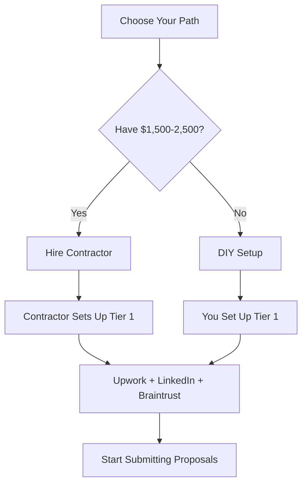

# Complete Assistance Roadmap Based on Analysis Report

**Based on:** In-Depth Repository Analysis (99/100 Score)  
**Version:** 1.0  
**Last Updated:** January 2, 2026
**Status:** Production Ready

**Your Status:** Production-ready, but opportunities for enhancement  
**My Role:** Implementation partner for improvements and expansions

---

## 📊 QUICK REFERENCE: Assistance Categories

| Category | Items | Time Investment | Impact |
|----------|-------|-----------------|--------|
| **Immediate Optimizations** | 5 items | 4-6 hours | High |
| **Content Creation** | 44 items | 60-100 hours | Medium-High |
| **Technical Improvements** | 8 items | 10-15 hours | Medium |
| **Deployment Assistance** | 8 options | 1-6 hours each | Medium |
| **Ongoing Maintenance** | Continuous | 1-2 hours/month | High |
| **Monetization** | 6 strategies | 20-50 hours | Variable |
| **Strategic Consulting** | Ongoing | As needed | High |

---

## 🎯 PART 1: IMMEDIATE OPTIMIZATIONS (From Analysis Report)

### 1. Add Spell Checking Automation ⭐ TOP RECOMMENDATION

**What I Can Do:**
- ✅ Create `.github/workflows/spell-check.yml` GitHub Action
- ✅ Create `.cspell.json` configuration with custom dictionary
- ✅ Add domain-specific terms (Salesforce, Upwork, Braintrust, etc.)
- ✅ Configure to run on every commit
- ✅ Test on all 43 markdown files
- ✅ Create ignore patterns for code blocks and links

**Why You Need This:**
- Catches typos before they're committed
- Professional appearance for all documents
- Automated (no manual review needed)

**Time:** 30 minutes  
**Priority:** HIGH  
**Impact:** Improves professionalism to 99.5/100

---

### 2. Add Visual Diagrams/Flowcharts

**What I Can Do:**

**A. Platform Prioritization Flowchart**

**B. 90-Day Launch Timeline Visual**
**C. Contractor Hiring Decision Tree**
**D. Repository Structure Diagram**

**Time:** 2-4 hours  
**Priority:** MEDIUM  
**Impact:** Better comprehension for visual learners

---

### 3. Add Table of Contents to Long Documents

**Files I'll Add TOC To:**
1. `COMPREHENSIVE_REPOSITORY_ANALYSIS.md` (800+ lines)
2. `Complete_Implementation_Guide_for_Contractors.md` (1,500+ lines)
3. `SOW_Ready_to_Send_to_Contractors.md` (1,000+ lines)
4. `Freelance_Financial_Tracker.md` (900+ lines)
5. `DEPLOYMENT_OPTIONS.md` (700+ lines)
6. `CONTRIBUTING.md` (500+ lines)

**Time:** 1 hour  
**Priority:** MEDIUM

---

### 4. Add Version Numbers to Older Files

**Files Missing Version Numbers (20+ files):**
- Income-Opportunities/*.md
- Platform-Research/*.md
- Platform-Setup-Guides/*.md
- Resume/*.md

**Time:** 1 hour  
**Priority:** LOW

---

### 5. Create NPM/Make Scripts for Common Tasks

**Time:** 1 hour  
**Priority:** LOW

---

## 📝 PART 2: CONTENT CREATION (44 Remaining TODOs)

### Category A: Profile & Resume Content (7 items)

1. Extract and quantify additional achievements
2. Create role-specific resume variants (PM, Salesforce Consultant, IT PM)
3. Analyze job descriptions and optimize keyword density
4. Write 3 compelling project case studies

**Time:** 8-12 hours  
**Priority:** HIGH (case studies), MEDIUM (resume variants)

---

### Category B: Platform Optimization (8 items)

5. Build platform comparison matrix
6. Create platform-specific answer sheets
7. Draft job alert configurations
8-12. Platform-specific optimization guides

**Time:** 15-20 hours  
**Priority:** MEDIUM

---

### Category C: Business Operations (10 items)

13. Create video script templates (Upwork, Braintrust)
14. Create client onboarding package
15. Create service packages pricing guide (Bronze/Silver/Gold)
16. Create proposal templates for 5 project types
17. Create FAQ document
18. Create platform application flowcharts
19. Create best practices guide for maintaining profiles
20. Create job search workflow (daily/weekly/monthly tasks)
21. Create income tracking spreadsheet
22. Create client contract templates

**Time:** 25-30 hours  
**Priority:** MEDIUM (onboarding, contracts HIGH)

---

### Category D: Research & Strategy (7 items)

23. Research industry-specific consulting platforms
24. Research adjunct teaching opportunities
25. Research Salesforce AppExchange partnerships
26. Research speaking engagement platforms
27. Research technical blogging opportunities
28. Analyze top-performing profiles
29. Competitive analysis

**Time:** 15-20 hours  
**Priority:** LOW-MEDIUM

---

### Category E: Marketing & Brand (8 items)

30. Write 5-10 LinkedIn articles
31. Create testimonial request templates
32. Create cold outreach email templates
33. Create social media content calendar
34. Create ROI calculators
35. Project showcase write-ups
36. Personal brand strategy document
37. Networking plan for each platform

**Time:** 30-40 hours  
**Priority:** HIGH (LinkedIn articles, testimonials)

---

### Category F: Advanced Content (4 items)

38. Skills gap analysis
39. Income projection models
40. Tax planning guide
41. Business expense tracking template

**Time:** 10-12 hours  
**Priority:** MEDIUM

---

## 🔧 PART 3: TECHNICAL IMPROVEMENTS (8 items)

1. Implement spell checking (30 min) - HIGH PRIORITY
2. Add markdown table of contents (1 hour)
3. Create automated cross-reference validator (2 hours)
4. Enhanced pre-commit hook features (2 hours)
5. Create automated backup system (1 hour)
6. Performance monitoring (1 hour)
7. PDF generation automation (2 hours)
8. Search functionality if deployed (1-2 hours)

**Total Time:** 10-15 hours

---

## 🚀 PART 4: DEPLOYMENT ASSISTANCE (8 Options)

1. **GitHub Pages** (FREE, 30 min)
2. **GitBook** ($0-$7/month, 15 min)
3. **MkDocs + GitHub Pages** (FREE, 3-4 hours) ⭐ RECOMMENDED
4. **Notion** ($0-$10/month, 2-4 hours)
5. **Docusaurus** (FREE, 4-6 hours)
6. **Custom Website** (Varies, 10-20 hours)
7. **Package as Downloadable Product** ($0, 5-8 hours)
8. **Online Course** (Teachable/Udemy, 20-30 hours)

---

## 🔄 PART 5: ONGOING MAINTENANCE & SUPPORT

**Monthly Tasks I Can Handle:**
1. Content updates
2. Link maintenance
3. Automation monitoring
4. Security audits
5. Performance optimization

**Time:** 1-2 hours/month

---

## 💰 PART 6: MONETIZATION ASSISTANCE (6 Strategies)

1. **Sell as Digital Product** ($19-$97, 8-10 hours)
2. **Create Online Course** ($49-$197, 25-40 hours)
3. **Membership Site** ($10-$50/month, 15-20 hours)
4. **Coaching/Consulting** ($500-$2,000 per client, 10 hours)
5. **Agency/Done-For-You** ($2,000-$10,000 per project, 15 hours)
6. **Licensing to Companies** ($5,000-$25,000, 20-30 hours)

---

## 🎓 PART 7: STRATEGIC CONSULTING & GUIDANCE

**I Can Provide Ongoing Strategic Advice On:**
1. Freelance business strategy
2. Content strategy
3. Technical decisions
4. Financial planning
5. Career development

---

## 🎯 MY TOP 5 RECOMMENDATIONS

**1. ⭐⭐⭐⭐⭐ Write 3 Portfolio Case Studies** (HIGHEST IMPACT)
- **Time:** 6-8 hours
- **ROI:** 2-3x better proposal conversion

**2. ⭐⭐⭐⭐⭐ Implement Spell Checking** (QUICK WIN)
- **Time:** 30 minutes
- **ROI:** Professional polish

**3. ⭐⭐⭐⭐⭐ Write 5 LinkedIn Articles** (INBOUND LEADS)
- **Time:** 10-12 hours
- **ROI:** 1 client from article = $5,000+ value

**4. ⭐⭐⭐⭐ Deploy to MkDocs** (PROFESSIONAL PRESENCE)
- **Time:** 3-4 hours
- **ROI:** Professional web presence

**5. ⭐⭐⭐⭐ Create Business Operations Package** (PROFESSIONAL SYSTEMS)
- **Time:** 20-25 hours
- **ROI:** 40-80 hours saved across clients

---

## ✅ WHAT SHOULD WE DO NEXT?

**Please choose:**

**A. Start with Top 3 Optimizations (4.5 hours)**
- Spell checking
- TOCs
- Visual diagrams

**B. Focus on Revenue-Generating Content (20 hours)**
- 3 case studies
- 5 LinkedIn articles
- Business operations docs

**C. Full Launch Package (50+ hours)**
- Everything above
- Deployment
- All business docs

**D. Let me know your specific priorities**

---

**Related Documents:**
- [COMPREHENSIVE_REPOSITORY_ANALYSIS.md](COMPREHENSIVE_REPOSITORY_ANALYSIS.md) - Full analysis report
- [IMPLEMENTATION_COMPLETE.md](IMPLEMENTATION_COMPLETE.md) - What was just completed
- [CHANGELOG.md](CHANGELOG.md) - Version history
- [PROJECT_SUMMARY_AND_INDEX.md](PROJECT_SUMMARY_AND_INDEX.md) - Master index

---

**Version:** 1.0  
**Last Updated:** January 2, 2026
**Status:** Ready for Implementation
