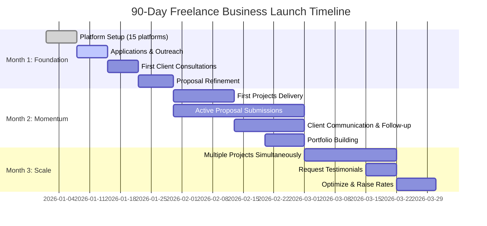
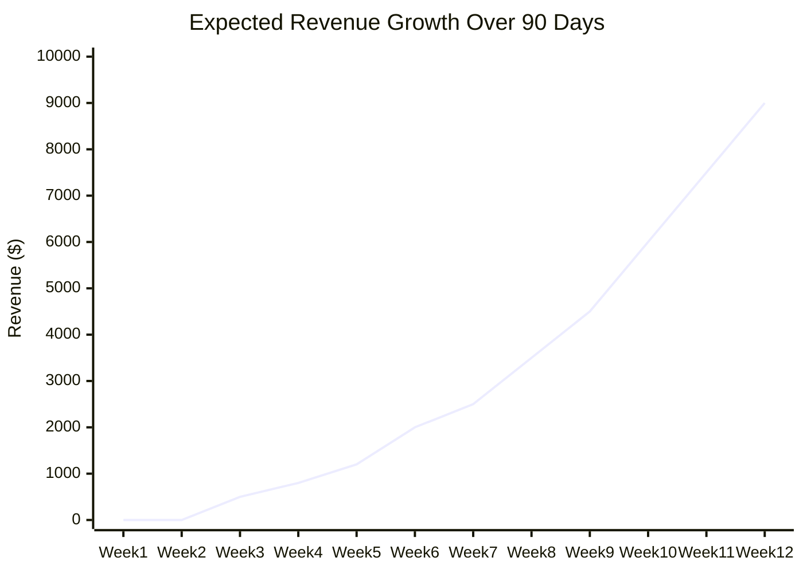
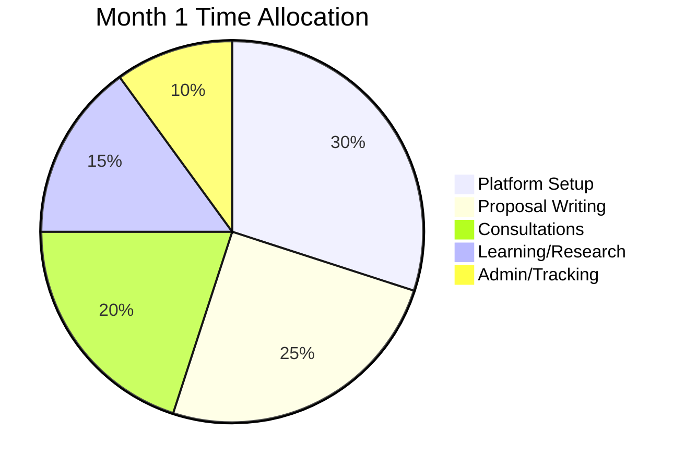
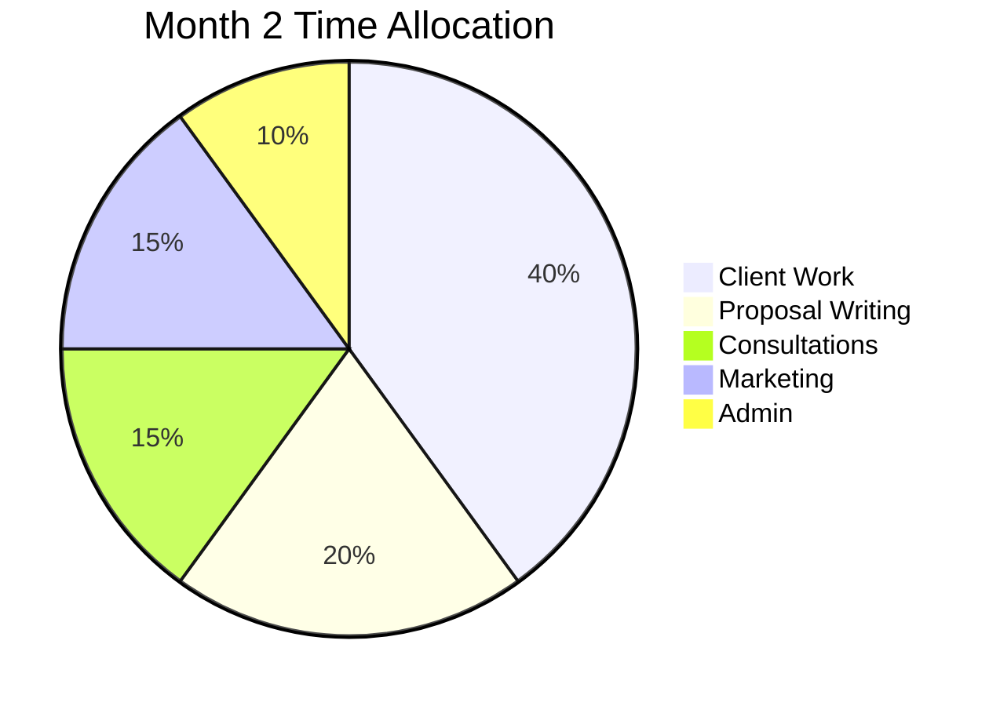
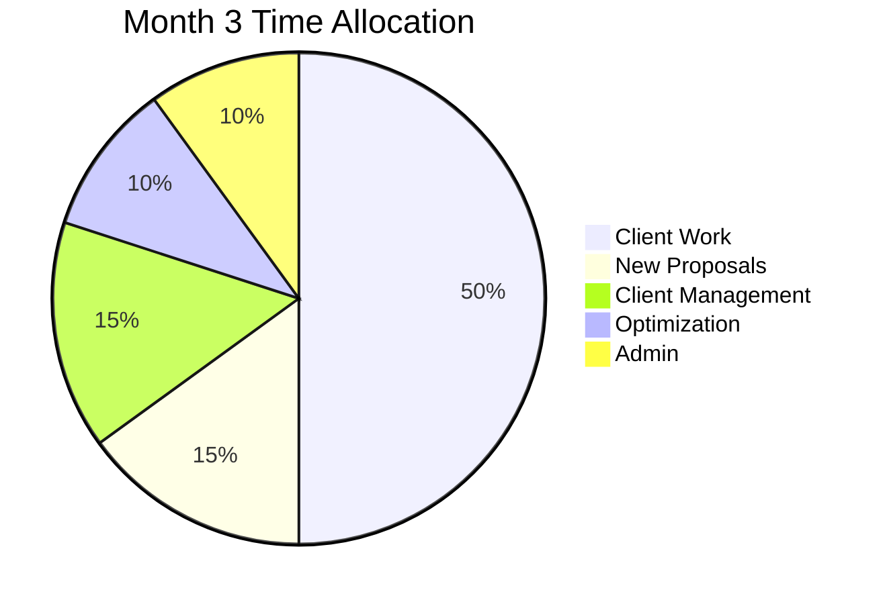

# 90-Day Freelance Business Launch Plan

**For:** Kristen Blanks - Business Systems Analyst  
**Start Date:** [Your chosen start date]  
**Goal:** Launch profitable freelance business generating $3,000-$10,000/month  
**Status:** Ready to Execute

---

## 🎯 Your 90-Day Goals

**Month 1:** Foundation & Setup
- ✅ All 15 platforms profiles live and optimized
- ✅ First 5 proposals submitted
- ✅ First client consultation completed
- 🎯 Target Revenue: $500-$1,500

**Month 2:** Momentum & Refinement
- ✅ First freelance project delivered successfully
- ✅ 5-10 active proposals/applications per week
- ✅ 3-5 client consultations completed
- 🎯 Target Revenue: $2,000-$5,000

**Month 3:** Scale & Optimize
- ✅ 2-3 active client projects simultaneously
- ✅ First testimonial/review received
- ✅ Repeat client or referral secured
- 🎯 Target Revenue: $3,000-$10,000

---

## 📊 Visual Timeline: 90-Day Launch Overview

**Key Milestones:**
- 🎯 **Day 7:** All platform profiles live
- 🎯 **Day 14:** First 10 proposals submitted
- 🎯 **Day 21:** First client consultation
- 🎯 **Day 30:** First project started ($500-$1,500)
- 🎯 **Day 45:** First project delivered + testimonial
- 🎯 **Day 60:** 2-3 active projects simultaneously
- 🎯 **Day 90:** $3,000-$10,000/month revenue trajectory

---

## 📈 Revenue Progression Chart

**Revenue Stages:**
- **Weeks 1-2:** $0 (Setup phase)
- **Weeks 3-4:** $500-$1,500 (First clients)
- **Weeks 5-8:** $2,000-$5,000 (Momentum building)
- **Weeks 9-12:** $3,000-$10,000 (Scaling phase)

---

## 🎯 Activity Breakdown by Phase

---

## MONTH 1: Foundation (Days 1-30)

### Week 1: Platform Setup Blitz

**Monday-Wednesday: Core Freelance Platforms**

| Day | Tasks | Time | Success Metrics |
|-----|-------|------|-----------------|
| **Day 1** | • Set up Braintrust profile • Set up LinkedIn Services Marketplace • Join relevant LinkedIn groups | 4-6 hrs | Profiles 60% complete |
| **Day 2** | • Complete Upwork profile to 100% • Upload portfolio items • Set availability | 4-6 hrs | Upwork shows 100% complete |
| **Day 3** | • Set up Indeed & FlexJobs • Configure 5 job alerts • Optimize resume for ATS | 3-4 hrs | Job alerts sending daily emails |

**Thursday-Friday: Education & Niche Platforms**

| Day | Tasks | Time | Success Metrics |
|-----|-------|------|-----------------|
| **Day 4** | • Set up Wyzant tutor profile • Set up MentorCruise mentor profile • Set pricing for tutoring/mentoring | 3-4 hrs | Profiles live, calendar open |
| **Day 5** | • Set up Udemy instructor account • Set up Teachable school • Create first course outline | 3-4 hrs | Instructor accounts approved |

**Weekend: Review & Optimize**

- Review all profiles for consistency
- Update professional summary across all platforms
- Test all profiles on mobile
- Ask friend to review for typos/clarity

**Week 1 Deliverables:**
- [ ] 10 platforms live (Upwork, Braintrust, LinkedIn, Indeed, FlexJobs, Wyzant, MentorCruise, Udemy, Teachable, Chegg)
- [ ] Professional photo uploaded to all
- [ ] Consistent bio across platforms
- [ ] Job alerts configured
- [ ] First proposals READY to submit (draft 3 in advance)

---

### Week 2: Outreach & Applications

**Monday-Wednesday: Premium Consulting Platforms**

| Day | Tasks | Time | Success Metrics |
|-----|-------|------|-----------------|
| **Day 8** | • Apply to GLG expert network • Apply to Catalant • Apply to FoundHQ | 3-4 hrs | Applications submitted |
| **Day 9** | • Apply to Toptal (rigorous screening) • Prepare for possible screening interviews | 2-3 hrs | Application submitted |
| **Day 10** | • Submit 3 Upwork proposals (start with small projects $500-$2,000) • Submit 2 Braintrust applications | 3-4 hrs | 5 proposals sent |

**Thursday-Friday: Job Boards & Active Applications**

| Day | Tasks | Time | Success Metrics |
|-----|-------|------|-----------------|
| **Day 11** | • Apply to 5 jobs on Indeed • Apply to 5 jobs on FlexJobs • Customize cover letters for each | 3-4 hrs | 10 applications sent |
| **Day 12** | • Apply to 3 adjunct teaching positions (HigherEdJobs, UMGC) • Set up Teachable course landing page | 3-4 hrs | Academic apps submitted |

**Weekend: Content Creation**

- Write first LinkedIn article: "5 Ways to Maximize Your Salesforce Investment"
- Create 2-3 portfolio case studies
- Film 60-second intro video for Upwork/Braintrust
- Batch create social media content for next week

**Week 2 Deliverables:**
- [ ] 15+ proposals/applications submitted
- [ ] First LinkedIn article published
- [ ] Video profile created
- [ ] 3 case studies added to portfolio
- [ ] Social media content calendar for Week 3

---

### Week 3: Follow-Up & Networking

**Monday-Wednesday: Follow-Up & Relationship Building**

| Day | Tasks | Time | Success Metrics |
|-----|-------|------|-----------------|
| **Day 15** | • Follow up on all proposals sent Week 2 • Personalize follow-up messages • Update proposals if no response | 2-3 hrs | 5-10 follow-ups sent |
| **Day 16** | • Network on LinkedIn (connect with 20 potential clients) • Comment on 10 posts in your industry • Share your published article | 1-2 hrs | 20 new connections |
| **Day 17** | • Join 3 Slack communities for freelancers/BAs • Introduce yourself • Offer value (answer questions) | 1-2 hrs | Active in communities |

**Thursday-Friday: More Proposals & Optimization**

| Day | Tasks | Time | Success Metrics |
|-----|-------|------|-----------------|
| **Day 18** | • Submit 5 new Upwork proposals (increase variety) • Submit 3 Braintrust applications | 3-4 hrs | 8 proposals sent |
| **Day 19** | • Optimize profiles based on learnings • A/B test different headlines/bios • Apply to 5 more jobs | 3-4 hrs | Profiles updated |

**Weekend: First Consultation (Hopefully!)**

- If you've received interview/consultation requests, prep thoroughly
- Research the company/client extensively
- Prepare questions and project approach
- Practice your pitch
- Send thank you emails after consultations

**Week 3 Deliverables:**
- [ ] 15-20 total proposals/apps this week
- [ ] First client consultation completed (goal)
- [ ] Growing LinkedIn presence (30+ new connections)
- [ ] Active in freelance communities
- [ ] Profiles optimized based on feedback

---

### Week 4: First Project & Momentum

**Monday-Wednesday: Land First Project**

| Day | Tasks | Time | Success Metrics |
|-----|-------|------|-----------------|
| **Day 22** | • Follow up on all consultations • Send proposals to interested prospects • Negotiate terms for first project | 2-4 hrs | Contract negotiations |
| **Day 23** | • Start first project (even if small!) • Set up project management (Trello/Asana) • Over-communicate with client | Varies | First project started ✅ |
| **Day 24** | • Continue first project • Send daily updates to client • Submit 3 more proposals to keep pipeline full | Varies | Project 25% complete |

**Thursday-Friday: Rinse & Repeat**

| Day | Tasks | Time | Success Metrics |
|-----|-------|------|-----------------|
| **Day 25** | • Continue first project • Submit 5 new proposals • Schedule tutoring sessions if any inquiries | Varies | Project 50% complete |
| **Day 26** | • Continue first project • Apply to 10 jobs • Publish second LinkedIn article | Varies | Multiple activities |

**Weekend: Month 1 Review**

**Review Metrics:**
- Proposals sent: ___ (Goal: 30-50)
- Interviews/consultations: ___ (Goal: 3-5)
- Projects secured: ___ (Goal: 1-2)
- Revenue generated: $___ (Goal: $500-$1,500)
- Platforms generating interest: ___

**Optimize for Month 2:**
- Which platforms are generating the most leads?
- What types of proposals get responses?
- What's your conversion rate (proposals → interviews)?
- Where should you focus more time?

**Week 4 Deliverables:**
- [ ] First freelance project in progress or completed
- [ ] 30-50 total proposals sent in Month 1
- [ ] 3-5 client consultations completed
- [ ] Second LinkedIn article published
- [ ] Month 1 performance review completed

---

## MONTH 2: Momentum (Days 31-60)

### Week 5-8 Structure

**Daily Routine (Monday-Friday):**

*Morning (2-3 hours):*
- Check emails/messages from clients and platforms
- Work on active client projects
- Send daily project updates

*Midday (2-3 hours):*
- Submit 2-3 proposals/applications
- Follow up on pending proposals
- Network on LinkedIn (15-20 minutes)

*Afternoon (1-2 hours):*
- Skill development (Salesforce study, certification prep)
- Content creation (articles, case studies, social media)
- Administrative tasks (invoicing, tracking)

**Weekly Goals:**
- 10-15 proposals/applications submitted
- 2-3 client consultations
- 1-2 active projects ongoing
- 1 piece of content published (article, case study, video)

### Month 2 Milestones

**Week 5 (Days 31-37):**
- [ ] Complete first project successfully
- [ ] Request testimonial/review from first client
- [ ] Update portfolio with first freelance project
- [ ] Start second project (parallel income streams!)
- [ ] Revenue Target: $500-$1,500 this week

**Week 6 (Days 38-44):**
- [ ] Begin Salesforce Administrator certification study (1hr/day)
- [ ] Optimize proposals based on Month 1 data
- [ ] Focus on platforms generating best leads
- [ ] Increase rates by 10-20% for new proposals
- [ ] Revenue Target: $1,000-$2,000 this week

**Week 7 (Days 45-51):**
- [ ] Deliver second project
- [ ] Secure third project
- [ ] First repeat client or referral (goal)
- [ ] Publish guest article on industry blog
- [ ] Revenue Target: $1,500-$2,500 this week

**Week 8 (Days 52-60):**
- [ ] Month 2 performance review
- [ ] Financial review (revenue, expenses, taxes)
- [ ] Strategy session: What's working? What to double down on?
- [ ] Plan Month 3 focus areas
- [ ] Revenue Target: $2,000-$5,000 total Month 2

### Month 2 Success Metrics

**Activity Metrics:**
- Proposals sent: ___ (Goal: 40-60)
- Consultations: ___ (Goal: 8-12)
- Projects delivered: ___ (Goal: 2-3)
- Articles published: ___ (Goal: 3-4)

**Financial Metrics:**
- Gross revenue: $___ (Goal: $2,000-$5,000)
- Hourly rate: $___ (Goal: $80-120/hr)
- Expenses: $___ (Goal: <$500)
- Net profit: $___ (Goal: $1,500-$4,500)

**Conversion Metrics:**
- Proposal → Interview conversion: ___% (Goal: 10-20%)
- Interview → Project conversion: ___% (Goal: 30-50%)
- Overall proposal → project: ___% (Goal: 5-10%)

---

## MONTH 3: Scale (Days 61-90)

### Week 9-12: Scaling Systems

**New Focus Areas:**

**1. Systemize Your Process (Week 9)**
- Create proposal templates for different project types
- Build client onboarding checklist
- Develop project delivery SOW template
- Set up automated invoicing (FreshBooks, Wave)
- Create FAQ document to send to prospects
- **Goal:** Reduce proposal time from 45min to 15min per proposal

**2. Increase Rates & Positioning (Week 10)**
- Raise rates by 20-30% based on Month 2 success
- Position yourself as specialist, not generalist
- Target larger projects ($5,000-$15,000) vs. small gigs
- Focus on 3-4 best-performing platforms only
- **Goal:** Higher revenue per hour worked

**3. Build Passive Income Streams (Week 11)**
- Launch first Udemy course
- Set up Teachable course with email sequence
- Schedule 5-10 tutoring/mentoring sessions
- Create lead magnet (free guide) to generate inbound leads
- **Goal:** $500-$1,000/month passive income by Month 4

**4. Solidify Your Brand (Week 12)**
- Publish 5+ LinkedIn articles (establish thought leadership)
- Get featured in industry publication or podcast
- Create YouTube channel with 3-5 videos
- Build email list (100+ subscribers goal)
- **Goal:** Inbound leads start coming to you

### Month 3 Milestones

**Week 9 (Days 61-67):**
- [ ] 2-3 simultaneous client projects
- [ ] Systems documented and templated
- [ ] Hired first subcontractor or VA (optional, if overwhelmed)
- [ ] Revenue Target: $2,500-$3,500 this week

**Week 10 (Days 68-74):**
- [ ] Raised rates successfully
- [ ] Secured first $5,000+ project
- [ ] Repeat client count: 2-3
- [ ] Revenue Target: $3,000-$4,000 this week

**Week 11 (Days 75-81):**
- [ ] First course launched (Udemy/Teachable)
- [ ] First passive income generated
- [ ] Referral system in place (asking clients for referrals)
- [ ] Revenue Target: $3,500-$4,500 this week

**Week 12 (Days 82-90):**
- [ ] 90-day review: What's working? What's not?
- [ ] Quarter 2 strategy planning
- [ ] Celebrate wins! 🎉
- [ ] Revenue Target: $3,000-$10,000 total Month 3

### Month 3 Success Metrics

**Activity Metrics:**
- Proposals sent: ___ (Goal: 30-40 - fewer but higher quality)
- Consultations: ___ (Goal: 10-15)
- Projects delivered: ___ (Goal: 4-6)
- Inbound leads: ___ (Goal: 5-10)

**Financial Metrics:**
- Gross revenue: $___ (Goal: $5,000-$15,000)
- Average project size: $___ (Goal: $2,500-$5,000)
- Hourly rate: $___ (Goal: $100-150/hr)
- Passive income: $___ (Goal: $200-$500)

---

## 📊 90-Day Summary Dashboard

**Total Activity:**
- Proposals sent: ___ (Goal: 100-150)
- Consultations: ___ (Goal: 20-30)
- Projects completed: ___ (Goal: 6-10)
- Articles published: ___ (Goal: 10-15)

**Financial Results:**
- Total revenue: $___ (Goal: $8,000-$25,000)
- Average monthly: $___ (Goal: $3,000-$10,000)
- Highest month: $___ 
- Average hourly rate: $___ (Goal: $80-150/hr)

**Platform Performance:**

| Platform | Leads | Projects | Revenue | Notes |
|----------|-------|----------|---------|-------|
| Upwork | | | $ | |
| Braintrust | | | $ | |
| LinkedIn | | | $ | |
| GLG/Catalant | | | $ | |
| Indeed Jobs | | | $ | |
| Tutoring | | | $ | |
| Courses | | | $ | |
| **TOTAL** | | | **$** | |

---

## 🚀 Days 91-180: What's Next?

**Quarter 2 Goals:**
1. **Consistent $5,000-$15,000/month revenue**
2. **50% repeat clients (sign retainers)**
3. **$1,000-$2,000/month passive income**
4. **Hired VA or subcontractor**
5. **Niche positioning established (e.g., "The Salesforce BA for Healthcare")**

**Long-Term Vision (Year 1):**
- Full-time freelance ($100,000-$150,000/year)
- 3-5 retainer clients
- Passive income covering basic expenses
- Speaking at 2-3 conferences
- Course generating $2,000-$5,000/month

---

## 💡 Weekly Habits for Success

**Monday:**
- Review last week's metrics
- Plan this week's proposal targets
- Schedule client check-ins

**Tuesday-Thursday:**
- Submit 2-3 proposals daily
- Work on client projects
- 1 hour networking/content

**Friday:**
- Send all project updates and invoices
- Follow up on proposals
- Plan next week

**Weekend:**
- Skill development (certifications)
- Content creation (articles, videos)
- Strategic planning

---

## 🎯 Key Success Factors

**Do These Daily:**
✅ Submit 2-3 high-quality proposals
✅ Over-communicate with active clients
✅ Spend 15-20 minutes on LinkedIn engagement
✅ Track all activities and metrics

**Avoid These Pitfalls:**
❌ Applying to jobs you're not qualified for (lowers success rate)
❌ Underpricing to win projects (race to the bottom)
❌ Over-delivering without compensation (scope creep)
❌ Neglecting to ask for testimonials/reviews
❌ Focusing on too many platforms at once

**Remember:**
- **Month 1 is about LEARNING** (expect low revenue)
- **Month 2 is about MOMENTUM** (expect some revenue)
- **Month 3 is about SCALING** (expect good revenue)

The first few weeks will feel slow. That's normal. Your pipeline takes 2-4 weeks to fill. By Week 8, you should have consistent flow of opportunities.

---

**Start Date:** ___________  
**Current Week:** ___________  
**On Track?** Yes / No  
**Next Milestone:** ___________

---

**Print this plan, put it on your wall, and check boxes as you go. You've got this! 🚀**
