# Contractor Hiring Decision Tree

**Version:** 1.0  
**Last Updated:** January 2, 2026
**Status:** Production Ready

**Purpose:** Visual decision tree to help you decide whether to hire a contractor and how to proceed  
**Use For:** Making informed decisions about contractor hiring vs. DIY

---

## 🤔 Should You Hire a Contractor?

This flowchart helps you determine if hiring a contractor is the right choice for you.

```mermaid
graph TD
    Start[Should I Hire a Contractor<br/>for Platform Setup?] --> Q1{Do you value your time<br/>at $50+/hour?}
    
    Q1 -->|Yes| Q2{Do you have $1,500+<br/>available to invest?}
    Q1 -->|No| DIY1[Consider DIY]
    
    Q2 -->|Yes| Q3{Do you want to launch<br/>within 3-4 weeks?}
    Q2 -->|No| Hybrid1[Consider Hybrid Approach]
    
    Q3 -->|Yes| HIRE[✅ HIRE A CONTRACTOR]
    Q3 -->|No| Q4{Are you comfortable<br/>with online platforms?}
    
    Q4 -->|No| HIRE
    Q4 -->|Yes| Hybrid2[Consider Hybrid or DIY]
    
    DIY1 --> DIYDetails[DIY Path:]
    DIYDetails --> DIY2[• 40-60 hours your time]
    DIY2 --> DIY3[• 6-8 weeks timeline]
    DIY3 --> DIY4[• Learning curve]
    DIY4 --> DIY5[• Full control]
    DIY5 --> DIYDecision{Worth it?}
    DIYDecision -->|Yes| DIYGo[✅ Go DIY]
    DIYDecision -->|No| ReconsiderHire[Reconsider Hiring]
    
    Hybrid1 --> HybridDetails[Hybrid Path:]
    HybridDetails --> H2[• Hire for Tier 1 only]
    H2 --> H3[• ~$500-800 investment]
    H3 --> H4[• DIY the rest]
    H4 --> H5[• 4-5 weeks total]
    H5 --> HybridGo[✅ Go Hybrid]
    
    HIRE --> HireDetails[Contractor Does:]
    HireDetails --> C2[• All 15 platforms]
    C2 --> C3[• Professional optimization]
    C3 --> C4[• 3-4 week delivery]
    C4 --> C5[• You review & approve]
    C5 --> Success[🎉 Launch in 4 Weeks]
    
    style Start fill:#e1f5ff
    style HIRE fill:#90ee90
    style DIYGo fill:#fff5cc
    style HybridGo fill:#ffd700
    style Success fill:#90ee90
```



---

## 💡 Hiring vs. DIY: The Real Cost Comparison


**Key Insight:** If you value your time at $50/hour or more, the real cost of DIY ($2,000-3,000 in time) equals or exceeds the cost of hiring ($1,750-3,000 total).

---

## 🎯 Quality vs. Cost Trade-offs

```mermaid
quadrantChart
    title Quality vs. Cost Analysis
    x-axis Low Cost --> High Cost
    y-axis Low Quality --> High Quality
    quadrant-1 Premium Choice
    quadrant-2 Best Value
    quadrant-3 Budget Option
    quadrant-4 Poor Value
    
    Full DIY (You): [0.2, 0.6]
    Hybrid Approach: [0.5, 0.75]
    Standard Contractor: [0.7, 0.85]
    Premium Contractor: [0.9, 0.95]
    Cheap Fiverr Gig: [0.3, 0.2]
```

**Explanation:**
- **Full DIY:** Low cost, medium quality (depends on your skill)
- **Hybrid:** Medium cost, high quality (professional where it matters)
- **Standard Contractor:** High cost, high quality (balanced approach)
- **Premium Contractor:** Highest cost, highest quality (best outcome)
- **Cheap Fiverr:** Low cost, low quality (not recommended)

---

## 📊 Decision Matrix: Which Option Is Right for You?


---

## ⚠️ Red Flags: When NOT to Hire a Contractor

```mermaid
graph TD
    Consider[Considering a Contractor?] --> Check1{Check for Red Flags}
    
    Check1 --> RF1[🚩 Contractor has<br/>no portfolio]
    Check1 --> RF2[🚩 Price is<br/>too good to be true<br/>under $500]
    Check1 --> RF3[🚩 No client reviews<br/>or testimonials]
    Check1 --> RF4[🚩 Poor communication<br/>in initial contact]
    Check1 --> RF5[🚩 Unwilling to sign<br/>NDA or contract]
    Check1 --> RF6[🚩 Promises 1-week<br/>delivery for all 15]
    Check1 --> RF7[🚩 Asks for 100%<br/>upfront payment]
    
    RF1 --> Avoid[❌ AVOID<br/>This Contractor]
    RF2 --> Avoid
    RF3 --> Avoid
    RF4 --> Avoid
    RF5 --> Avoid
    RF6 --> Avoid
    RF7 --> Avoid
    
    Check1 --> GF1[✅ Has strong<br/>portfolio]
    GF1 --> GF2[✅ Transparent<br/>pricing]
    GF2 --> GF3[✅ Good reviews<br/>4.5+ stars]
    GF3 --> GF4[✅ Responsive<br/>communication]
    GF4 --> GF5[✅ Willing to use<br/>milestone payments]
    GF5 --> GF6[✅ Realistic timeline<br/>3-4 weeks]
    GF6 --> Proceed[✅ SAFE TO HIRE]
    
    style Avoid fill:#ffcccc
    style Proceed fill:#90ee90
```



---

## 🔍 Contractor Vetting Process

```mermaid
graph LR
    Start[Found a Contractor] --> Step1[📝 Step 1:<br/>Review Portfolio]
    
    Step1 --> Step2[⭐ Step 2:<br/>Check Reviews<br/>Need 4.5+ stars]
    
    Step2 --> Step3[💬 Step 3:<br/>Initial Interview<br/>Ask screening questions]
    
    Step3 --> Step4[📄 Step 4:<br/>Request Proposal<br/>with timeline + price]
    
    Step4 --> Step5[🤝 Step 5:<br/>Negotiate Terms<br/>milestone payments]
    
    Step5 --> Step6[✍️ Step 6:<br/>Sign Contract<br/>SOW + NDA]
    
    Step6 --> Step7[💰 Step 7:<br/>First Payment<br/>25-33% upfront]
    
    Step7 --> Step8[🚀 Step 8:<br/>Project Kickoff]
    
    style Start fill:#e1f5ff
    style Step8 fill:#90ee90
```



**Estimated Time:** 1-2 weeks from finding contractor to project start

---

## 💼 Contractor Selection Criteria

| Criteria | Weight | What to Look For | Deal Breaker If... |
|----------|--------|------------------|-------------------|
| **Portfolio** | 30% | 3+ similar projects (Upwork, LinkedIn profiles) | No portfolio at all |
| **Reviews** | 25% | 10+ reviews, 4.8+ average | Below 4.5 stars |
| **Communication** | 20% | Responds within 24 hours, clear English | Poor/slow communication |
| **Pricing** | 10% | $1,500-2,500 range | Under $500 or over $5,000 |
| **Timeline** | 10% | 3-4 weeks realistic | Promises under 1 week |
| **Expertise** | 5% | Specializes in profile optimization | Generalist with no niche |

**Minimum Score to Hire:** 75/100

---

## 📋 Final Decision Checklist

Before you make your final decision, check:

### ✅ Choose HIRE if:
- [ ] Your time is worth $50+/hour professionally
- [ ] You have $1,500+ available to invest
- [ ] You want to launch within 3-4 weeks
- [ ] You'd rather focus on client work than setup
- [ ] You want professional-quality profiles from day 1
- [ ] You're not comfortable with platform optimization

### ✅ Choose HYBRID if:
- [ ] You have $500-1,500 available
- [ ] You can dedicate 20-30 hours over 4-5 weeks
- [ ] You're comfortable with technology
- [ ] You want quality on key platforms (Upwork, LinkedIn)
- [ ] You're okay with DIY for less critical platforms

### ✅ Choose DIY if:
- [ ] You have minimal budget (under $500)
- [ ] You have 40-60 hours available over 6-8 weeks
- [ ] You're tech-savvy and enjoy learning new platforms
- [ ] You want maximum control over your profiles
- [ ] You're not in a rush to launch

---

## 🚀 Next Steps Based on Your Decision

### If You Chose: HIRE
1. ✅ Read: [Contractor_Evaluation_Rubric.md](Contractor_Evaluation_Rubric.md)
2. ✅ Use: [Sample_Upwork_Job_Posting.md](Sample_Upwork_Job_Posting.md)
3. ✅ Prepare: [Interview_Questions_for_Contractors.md](../Contractor-Hiring-Support/Interview_Questions_for_Contractors.md)
4. ✅ Sign: [SOW_Ready_to_Send_to_Contractors.md](SOW_Ready_to_Send_to_Contractors.md)

### If You Chose: HYBRID
1. ✅ Hire specialist for Upwork + LinkedIn (~$800)
2. ✅ Use contractor's work as template for other platforms
3. ✅ Follow: [Complete_Implementation_Guide_for_Contractors.md](Complete_Implementation_Guide_for_Contractors.md)

### If You Chose: DIY
1. ✅ Start: [First_Week_Action_Plan.md](../Career-Planning/First_Week_Action_Plan.md)
2. ✅ Track: [Platform_Setup_Tracking_Dashboard.md](../Tracking-Tools/Platform_Setup_Tracking_Dashboard.md)
3. ✅ Reference: [Complete_Platform_Setup_Guide.md](../Platform-Setup-Guides/Complete_Platform_Setup_Guide.md)

---

## 📞 Still Unsure?

**Calculate your true cost:**

```
DIY True Cost = (Your Hourly Rate) × (Hours Required)
Example: $50/hour × 50 hours = $2,500

If DIY True Cost ≥ Contractor Cost → HIRE
If DIY True Cost < Contractor Cost → DIY or HYBRID
```

**Quick Test:**
Would you pay someone $2,000-3,000 to save you 40-60 hours?
- **Yes** → Hire a contractor
- **No** → DIY or Hybrid

---

**Related Documents:**
- [Platform_Prioritization_Flowchart.md](../Platform-Setup-Guides/Platform_Prioritization_Flowchart.md)
- [Budget_and_Pricing_Guide.md](Budget_and_Pricing_Guide.md)
- [Contractor_Evaluation_Rubric.md](../Contractor-Hiring-Support/Contractor_Evaluation_Rubric.md)

**Version:** 1.0  
**Last Updated:** January 2, 2026
