# Platform Setup: Decision Flowchart & Prioritization Guide

**Version:** 1.0  
**Last Updated:** January 2, 2026
**Status:** Production Ready

**Purpose:** Visual decision tree to help you choose the best platform setup strategy  
**Use For:** Deciding between DIY vs. hiring contractors, and which platforms to prioritize

---

## 🎯 Platform Setup Decision Flowchart

This flowchart helps you decide the optimal approach based on your budget, time, and goals.

```mermaid
graph TD
    Start[Start: Need to Set Up 15 Platforms] --> Question1{Do you have $1,500-$2,500 budget?}
    
    Question1 -->|Yes| Question2{Do you have 2-3 weeks to manage a contractor?}
    Question1 -->|No| Question3{Do you have 4-6 weeks for DIY setup?}
    
    Question2 -->|Yes| HireContractor[✅ RECOMMENDED: Hire Contractor]
    Question2 -->|No| HybridApproach[⚠️ Hybrid Approach]
    
    Question3 -->|Yes| DIYSetup[✅ DIY Setup Path]
    Question3 -->|No| MinimalSetup[⚠️ Minimal Setup Strategy]
    
    HireContractor --> ContractorPath[Contractor Does:]
    ContractorPath --> C1[• All 15 platforms]
    ContractorPath --> C2[• Professional optimization]
    ContractorPath --> C3[• Consistent branding]
    ContractorPath --> C4[• 3-4 week timeline]
    C4 --> ContractorResult[Result: Professional setup across all platforms]
    
    HybridApproach --> HybridPath[You Do:]
    HybridPath --> H1[• Hire specialist for Tier 1 only]
    HybridPath --> H2[• DIY Tier 2 and 3]
    H2 --> HybridResult[Result: Quality on key platforms, manual on rest]
    
    DIYSetup --> DIYPath[You Do All Platforms:]
    DIYPath --> D1[• Week 1: Tier 1 platforms]
    DIYPath --> D2[• Week 2-3: Tier 2 platforms]
    DIYPath --> D3[• Week 4-6: Tier 3 platforms]
    D3 --> DIYResult[Result: Full control, 4-6 week timeline]
    
    MinimalSetup --> MinimalPath[Focus on Top 3 Only:]
    MinimalPath --> M1[1. LinkedIn + Upwork]
    MinimalPath --> M2[2. Braintrust]
    MinimalPath --> M3[3. Indeed]
    M3 --> MinimalResult[Result: Quick start, expand later]
    
    ContractorResult --> Success[🎉 Start Applying!]
    HybridResult --> Success
    DIYResult --> Success
    MinimalResult --> Success
    
    style Start fill:#e1f5ff
    style HireContractor fill:#90ee90
    style DIYSetup fill:#90ee90
    style HybridApproach fill:#fff5cc
    style MinimalSetup fill:#ffcccc
    style Success fill:#ffd700
```



---

## 📊 Platform Prioritization by Tier

This diagram shows which platforms to set up first based on ROI and complexity.

```mermaid
graph LR
    subgraph Tier_1[🏆 TIER 1 - Highest Priority]
        T1A[Upwork<br/>$$$$$<br/>Highest volume]
        T1B[LinkedIn<br/>$$$$$<br/>Professional brand]
        T1C[Braintrust<br/>$$$$$<br/>Premium rates]
    end
    
    subgraph Tier_2[⭐ TIER 2 - High Priority]
        T2A[Indeed<br/>$$$$<br/>Job search]
        T2B[FlexJobs<br/>$$$<br/>Remote jobs]
        T2C[Toptal<br/>$$$$$<br/>Elite network]
    end
    
    subgraph Tier_3[✅ TIER 3 - Medium Priority]
        T3A[Wyzant<br/>$$<br/>Tutoring]
        T3B[MentorCruise<br/>$$<br/>Mentoring]
        T3C[Udemy<br/>$$$<br/>Passive income]
    end
    
    subgraph Tier_4[📝 TIER 4 - Nice to Have]
        T4A[Chegg<br/>$<br/>Tutoring]
        T4B[Teachable<br/>$$<br/>Courses]
        T4C[HigherEdJobs<br/>$$$<br/>Academic]
        T4D[BELAY<br/>$$<br/>VA roles]
        T4E[UMGC<br/>$$$<br/>Faculty]
        T4F[Coursera<br/>$$<br/>Teaching]
    end
    
    Start[Your Journey] --> Tier_1
    Tier_1 --> Tier_2
    Tier_2 --> Tier_3
    Tier_3 --> Tier_4
    
    style Tier_1 fill:#ffd700
    style Tier_2 fill:#c0c0c0
    style Tier_3 fill:#cd7f32
    style Tier_4 fill:#e8e8e8
    style Start fill:#90ee90
```

---

## 💰 Budget-Based Recommendations

```mermaid
graph TD
    Budget{What's Your Budget?}
    
    Budget -->|$2,500+<br/>Full Service| Premium[Hire Full-Service Contractor]
    Budget -->|$1,500-$2,500<br/>Standard| Standard[Hire for All 15 Platforms]
    Budget -->|$500-$1,500<br/>Hybrid| Hybrid[Hire for Tier 1 Only]
    Budget -->|$100-$500<br/>Minimal| Minimal[Hire for LinkedIn Only]
    Budget -->|$0<br/>Bootstrap| Free[DIY Everything]
    
    Premium --> P1[• Top contractor]
    P1 --> P2[• All platforms optimized]
    P2 --> P3[• Professional photos included]
    P3 --> P4[• Video scripts included]
    P4 --> P5[• 2-3 week delivery]
    P5 --> PResult[🏆 Best outcome]
    
    Standard --> S1[• Experienced contractor]
    S1 --> S2[• All 15 platforms]
    S2 --> S3[• Standard optimization]
    S3 --> S4[• 3-4 week delivery]
    S4 --> SResult[✅ Great outcome]
    
    Hybrid --> H1[• Specialist for Upwork]
    H1 --> H2[• Specialist for LinkedIn]
    H2 --> H3[• DIY the rest]
    H3 --> HResult[⚠️ Good outcome]
    
    Minimal --> M1[• LinkedIn expert only]
    M1 --> M2[• DIY all others]
    M2 --> MResult[⚠️ Okay outcome]
    
    Free --> F1[• Use templates provided]
    F1 --> F2[• 4-6 weeks DIY]
    F2 --> F3[• Learn as you go]
    F3 --> FResult[📚 Learning experience]
    
    style Premium fill:#ffd700
    style Standard fill:#90ee90
    style Hybrid fill:#fff5cc
    style Minimal fill:#ffcccc
    style Free fill:#e8e8e8
```



---

## ⏱️ Time Investment Comparison


**Legend:**
- **Full Contractor:** 3-4 weeks total (minimal your time)
- **Hybrid:** 4-5 weeks total (moderate your time)
- **Full DIY:** 6-8 weeks total (high your time)

---

## 🎯 Quick Decision Matrix

| Your Situation | Recommended Path | Why |
|---------------|------------------|-----|
| **Have $2,000+ & want to launch ASAP** | ✅ Hire contractor for all 15 | Fastest, most professional outcome |
| **Have $1,000-2,000 & some time** | ⚠️ Hybrid (hire Tier 1, DIY rest) | Balance of quality and cost |
| **Have minimal budget but lots of time** | ⚠️ Full DIY with templates | Learn the platforms deeply |
| **Want to test the waters first** | ⚠️ Minimal setup (top 3 only) | Quick start, low commitment |
| **Established freelancer adding platforms** | ✅ Hire specialist for 1-2 platforms | Your time is worth more than cost |

---

## 🚀 Next Steps Based on Your Choice

### If You Chose: Hire Contractor
1. ✅ Read: [Statement_of_Work.md](../Contractor-Hiring-SOW/SOW_Ready_to_Send_to_Contractors.md)
2. ✅ Use: [Sample_Upwork_Job_Posting.md](../Contractor-Hiring-SOW/Sample_Upwork_Job_Posting.md)
3. ✅ Review: [Contractor_Evaluation_Rubric.md](../Contractor-Hiring-Support/Contractor_Evaluation_Rubric.md)

### If You Chose: Hybrid Approach
1. ✅ Hire specialist for Upwork/LinkedIn
2. ✅ Use: [Complete_Implementation_Guide_for_Contractors.md](../Contractor-Hiring-SOW/Complete_Implementation_Guide_for_Contractors.md)
3. ✅ DIY the rest using guides in `/Platform-Setup-Guides/`

### If You Chose: Full DIY
1. ✅ Start with: [First_Week_Action_Plan.md](../Career-Planning/First_Week_Action_Plan.md)
2. ✅ Follow: [QUICK_START_CHECKLIST.md](../QUICK_START_CHECKLIST.md)
3. ✅ Track progress: [Platform_Setup_Tracking_Dashboard.md](../Tracking-Tools/Platform_Setup_Tracking_Dashboard.md)

### If You Chose: Minimal Setup
1. ✅ Focus on LinkedIn first (highest ROI)
2. ✅ Then Upwork (most opportunities)
3. ✅ Then Braintrust (best rates)
4. ✅ Expand to others once you land first client

---

## 📞 Still Unsure? Answer These Questions:

1. **Budget:** How much can you invest upfront? ($0 / $500 / $1,500 / $2,500+)
2. **Time:** How many hours per week can you dedicate? (2-5 hrs / 10-15 hrs / 20+ hrs)
3. **Urgency:** How soon do you need income? (1 month / 2-3 months / No rush)
4. **Experience:** Have you freelanced before? (Yes / No)
5. **Technical:** Are you comfortable with online platforms? (Yes / Somewhat / No)

**Scoring:**
- **Mostly "high budget/low time/urgent"** → Hire contractor
- **Mixed responses** → Hybrid approach
- **Mostly "low budget/high time/not urgent"** → DIY
- **Very low budget but urgent** → Minimal setup (top 3 platforms)

---

**Related Documents:**
- [Complete_Platform_Setup_Guide.md](Complete_Platform_Setup_Guide.md)
- [Profile_Setup_Services_Guide.md](Profile_Setup_Services_Guide.md)
- [90_Day_Freelance_Launch_Plan.md](../Career-Planning/90_Day_Freelance_Launch_Plan.md)

**Version:** 1.0  
**Last Updated:** January 2, 2026
